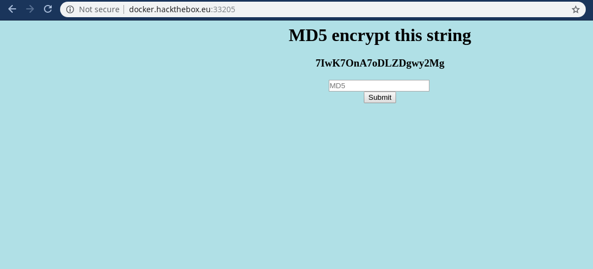

## Emdee five for life writeup (HACK THE BOX)

Welcome Readers, Today we will be doing the hackthebox(HTB) challenge 

## Starting point...


<br/>
our only task is to submit the string  after converting it to md5 hash ...but when i tried to submit i got this...


<br/>
Yup *Too slow*

Let's automate this and build a python script for it and i will be using:-
  - re module       (For regex)
  - hashlib module  (For md5 )
  - requests module (For GET and post)
  
<br/>

## Source code

```html
<html>
<head>
<title>emdee five for life</title>
</head>
<body style="background-color:powderblue;">
<h1 align='center'>MD5 encrypt this string</h1><h3 align='center'>fDRusAk7w752Hy5b5iNx</h3><p align='center'>HTB{N1c3_ScrIpt1nG_B0i!}</p><center><form action="" method="post">
<input type="text" name="hash" placeholder="MD5" align='center'></input>
</br>
<input type="submit" value="Submit"></input>
</form></center>
</body>
</html>
```
## Building the script

So with my crappy skills of regex let's start building the logic ...<br/>

```
><h3 align='center'>sR1LvFdED1Toos1uBn6k</h3>
```
This was achieved by using this ...
```
center'>+.*?</h3>
```
<br/>

Now we will filter it more and will make the final script...
<br/>
```python
import requests
import hashlib
import re


url="http://docker.hackthebox.eu:33205/"

r=requests.session()
out=r.get(url)
out=re.search("<h3 align='center'>+.*?</h3>",out.text)
out=re.search("'>.*<",out[0])
out=re.search("[^|'|>|<]...................",out[0])

out=hashlib.md5(out[0].encode('utf-8')).hexdigest()

print("sending md5 :-{}".format(out))

data={'hash': out}
out = r.post(url = url, data = data)

print(out.text)
```
<br/>
## Getting the flag 
Now time to run the script and get the flag :)


<br/>
There we go we got our flag ...sorry for bad regex lol i am new at this, anyways if you guys like my writeup stay tuned will post more :neckbeard:
